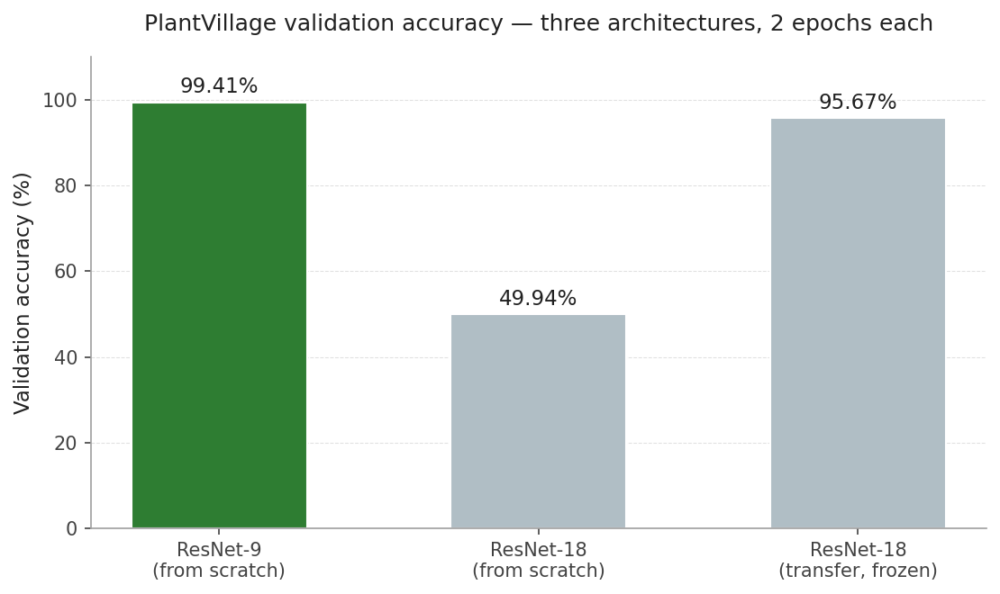
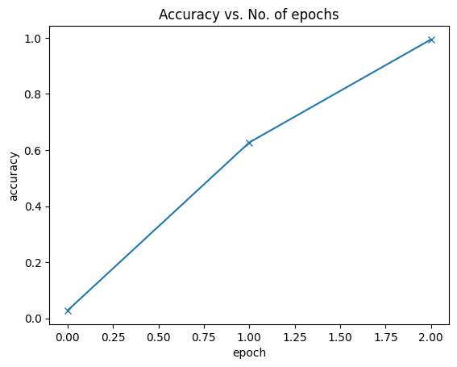

# Plant Disease Detection with CNNs

> A research project comparing three convolutional architectures on the PlantVillage leaf-disease dataset, with a custom ResNet-9 reaching **99.41% validation accuracy** in two epochs.

## Problem

Crop disease lowers yield and is hard to catch early without an expert eye. The PlantVillage dataset offers a large labelled corpus of leaf photographs across 14 plants and 38 health states, which makes it a natural benchmark for asking how cheaply a convolutional model can learn to recognise these conditions.

This project is a study, not a product. The question I wanted to answer is concrete: on a fixed two-epoch budget, does a compact custom architecture, a deeper textbook architecture, or a frozen pre-trained backbone produce the best classifier, and how do they fail when they fail?

## Approach

Three architectures were trained and compared under the same one-cycle learning-rate schedule, the same optimiser (Adam), the same gradient clipping, and the same two-epoch budget.

**ResNet-9 from scratch.** A compact custom architecture with two residual blocks, ~6.6M parameters, trained end-to-end from random initialisation. Designed to be deep enough for the texture and shape cues of diseased leaf tissue while staying small enough to converge quickly on a single GPU.

**ResNet-18 from scratch.** The standard `torchvision` ResNet-18 (~11.2M parameters) trained from random initialisation under the same recipe. Included as a sanity check on the architecture choice: more layers and more parameters on identical data and identical training budget.

**ResNet-18 with ImageNet transfer learning.** The same ResNet-18 but loaded with `IMAGENET1K_V1` weights, with the backbone frozen and only the final classification head retrained. A 6-trial random search over learning rate and weight decay selected the best configuration. The point of this third comparison is to test whether ImageNet-pretrained edge and texture filters generalise cheaply to leaf imagery, with ~340x fewer trainable parameters than ResNet-9.

## Results

| Model | Validation accuracy | Training time | Parameters (trainable) |
| --- | --- | --- | --- |
| **ResNet-9 (from scratch)** | **99.41%** | 7m 58s | 6,589,734 |
| ResNet-18 (from scratch) | 49.94% | 3m 27s | 11,196,006 |
| ResNet-18 (transfer, frozen) | 95.67% | n/a | 19,494 |

ResNet-9 wins decisively under the fixed two-epoch budget, and the frozen transfer-learning baseline is the cheapest competitive alternative.



The ResNet-9 validation-accuracy curve climbs cleanly from ~2% (chance) to ~63% after the first epoch, then settles at 99.41% by the end of the second epoch. The one-cycle learning-rate schedule does the heavy lifting in the second half of training.



A full confusion matrix on the ~17.5k validation images, and a grid of per-image predictions on the small held-out test set, are generated by the last three cells of `notebooks/plant_cv.ipynb` (section *Save figures for the README*). These cells need the trained model and the dataset loaded into memory, so they are not pre-rendered here.

## Key Findings

The headline result is that ResNet-9 beat the deeper ResNet-18 by ~50 percentage points on the same training budget. The bottleneck for the deeper model was not capacity. It was optimisation. Two epochs is plenty for a 6.6M-parameter model with a well-tuned one-cycle schedule to settle into a good basin, but it is nowhere near enough for an 11M-parameter model starting from random weights to do the same. Doubling the parameters did not double the accuracy; it cratered it.

Frozen-backbone transfer learning was the surprise. Retraining only the 19,494-parameter classifier head on top of ImageNet features reached ~96% validation accuracy, within ~4 points of ResNet-9 and at a tiny fraction of the compute. ImageNet pre-training already encodes the kind of edge, colour, and texture priors that leaf disease recognition cares about.

The 33-image extra test set that ships with PlantVillage was perfectly classified by ResNet-9. All 33 predictions correct. Useful as a smoke test, too small to be a real test set; the validation accuracy on ~17.5k images is the metric to read.

## Repo Structure

```
plant-disease-detection/
├── README.md
├── requirements.txt
├── assets/
│   ├── results_comparison.png
│   └── training_accuracy.png
├── docs/
│   ├── Cahier_des_charges.pdf      # original French project spec
│   ├── Rapport_final.pdf           # original French 1-page final report
│   └── journal_projet.md           # deployment journal (English)
├── models/
│   └── plant-disease-model.pth     # best ResNet-9 checkpoint, ~26 MB
├── notebooks/
│   └── plant_cv.ipynb              # full training & evaluation notebook
├── src/
│   ├── __init__.py
│   └── api.py                      # FastAPI inference service (deprecated)
├── Dockerfile                      # Cloud Run image build (deprecated)
└── .dockerignore                   # (deprecated)
```

## Setup

The notebook is the entry point. Outputs (training curves, model summaries, sample predictions) are committed, so the notebook renders on GitHub without re-running.

To re-run locally:

```bash
python -m venv .venv
source .venv/bin/activate   # Windows: .venv\Scripts\activate
pip install -r requirements.txt
pip install jupyter
jupyter notebook notebooks/plant_cv.ipynb
```

The dataset is downloaded inside the notebook (PlantVillage augmented variant via `gdown`). Training time on a single consumer GPU is ~8 minutes for the ResNet-9 run.

## Deployment Note

This project was originally deployed as a FastAPI inference service on Google Cloud Run. **The deployment is no longer live.** The GCP free trial expired and the project is not being redeployed. The deployment artifacts (`Dockerfile`, `.dockerignore`, `src/api.py`) are preserved in this repository for reference and are marked `DEPRECATED` at the top of each file.

## Next Steps

A few directions I would take this if I came back to it:

- Train ResNet-18 from scratch for more epochs (10 to 20) to give the deeper model a fair shot and confirm the finding is about budget, not capacity.
- Replace the random search over frozen-backbone hyperparameters with a fine-tuning pass that unfreezes the last few backbone stages at a low learning rate.
- Move beyond PlantVillage to in-the-wild leaf photographs (uncontrolled lighting, occlusion, multiple leaves per frame) to test how much of the 99% accuracy is dataset-specific.
- Add gradient-based saliency maps so misclassifications are interpretable.

## Tech Stack

PyTorch, Torchvision, NumPy, Pillow, Matplotlib, Jupyter; FastAPI / Uvicorn / Docker for the (now-deprecated) inference service.

## License

MIT.

## Contact

Mohamed Sanoussy Camara · [LinkedIn](https://www.linkedin.com/) · [Portfolio](https://github.com/MoCamaraData) · [GitHub](https://github.com/MoCamaraData)
